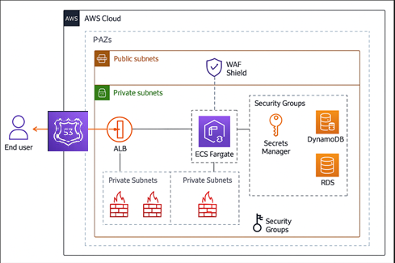
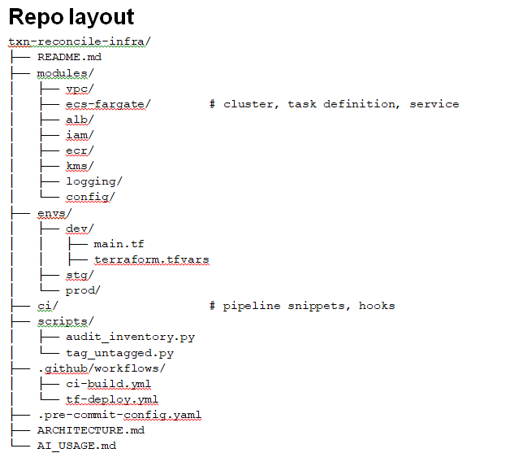

**ARCHITECTURE: txn-reconcile-api**

**Purpose**

The goal of this project was to move from a legacy monolith application to a secure, scalable microservice called txn-reconcile-api. Since it handles financial transactions, the design needed to be PCI DSS Level 1 compliant, internet-facing, and cloud-ready. The objective was to use AWS ECS Fargate for serverless compute, which included high security and CI/CD automation.

**Assumptions**

> AWS account is accessible and Route53 hosted zone exists for domain.
> Environments: dev, stage, prod (separate terraform workspaces or separate accounts).
> Service stateful needs: metadata stored in Dynamo DB (default) or RDS if transactions    require SQL.

  

 

**High-level components**
> Network: VPC (3 AZs), public subnets (ALB), private subnets (Fargate), NAT gateway(s), VPC Flow Logs.
> 
> Compute: ECS Fargate service (task definitions), auto-scaling.
> 
> Ingress: Internet ALB (HTTPS), ACM certificate, WAF.
> 
> Storage: Dynamo DB (or RDS), S3 (logs and artifacts).
> 
> Security: KMS Keys, Secrets Manager, IAM least privilege, Cloud Trail, Guard Duty, AWS config.
> 
> CI/CD: GitHub Actions (build, scan, push, terraform plan/apply).
> 
> Monitoring: CloudWatch metrics/alarms, SNS for alerts.

**Top-level approach**

Multi-environment Terraform (dev/stg/prod) using a module-based layout and remote state in an S3 bucket with Dynamo DB locking.
1.	Run the txn-reconcile-api as ECS Fargate service behind an Internet-facing Application Load Balancer (HTTPS) with ACM certificate (DNS validation).
   
2.	Strong security baseline for PCI:
   
> VPC segmentation (private subnets for tasks, NAT for egress)
> 
> KMS for data and secrets
> 
> Secrets in AWS Secrets Manager (no hard-coded secrets)
> 
> Cloud Trail (multi-region), VPC Flow Logs, AWS Config, Guard Duty, Security Hub
> 
> Centralized logging (CloudWatch + S3 export) and retention rules
> 
> IAM least privilege (task/execution roles), SSM Session Manager for ops access
> 
> WAF + Shield Advanced (recommendation)

3.	CI/CD (GitHub Actions): build → scan → push to ECR → update infra (terraform plan in PR; apply to dev automatically, manual approvals for prod/stg).

**Risks / next steps** 
> Incomplete asset inventory — some resources may be untagged; central tagging enforcement needed.
> 
> Vulnerability scanning gaps — must ensure runtime scanning, regular container rebuilds, and dependency checks.
> 
>	DR limits — no cross-region active-active implementation by default.
> 
> Third-party dependencies — any external endpoints used by tasks must meet security reviews.

__________________________________
**Minimal things**

> Enable Cloud Trail multi-region
> 
> KMS  for all at-rest encryption (including S3 server side, RDS, EBS, Dynamo DB table encryption if applicable).
> 
> Secrets Manager
> 
> Network segmentation — tasks should only be reachable via ALB.
> 
> Least-privilege IAM policies with role separation for CI and operators.
> 
> Centralized logs + export to immutable S3 bucket with versioning and lifecycle.
> 
> IaC and container scanning in CI (tfsec, trivy).

  

________________________________________

**Step-by-step implementation plan**

Below each step includes sample code snippets.
1) Git repo + pre-commit
   
> Initialize git repo.
> 
> Add pre-commit with checks:
> 
> terraform fmt
> 
> tflint
> 
> terraform validate
> 
> tfsec (security scanning)
> 
> yamllint
> 
> .pre-commit-config.yaml
> 
repos:

     rev: v1.73.0
     https://github.com/itkhan007/txn-reconcile-api/tree/main/.github/workflows
     hooks:
      - id: terraform_fmt
      - id: terraform_validate
      - id: tflint

    

2) Terraform backend (remote state) and providers
   
> Create a centralized S3 bucket for Terraform state (encrypted with KMS) and a DynamoDB table for locks.
> 
>	Use per-environment state paths (envs/dev/terraform.tfstate).
> 
Example backend.tf used in each env:

terraform {
  backend "s3" {
    bucket         = "txn-reconcile-tfstate-<org>-<account>"
    key            = "envs/${terraform.workspace}/terraform.tfstate"
    region         = "us-east-1"
    dynamodb_table = "txn-reconcile-tfstate-locks"
    encrypt        = true
  }
}

3) Networking (module modules/vpc)
   
> Multi-AZ VPC, public subnets for ALB, private subnets for tasks, NAT Gateways (or NAT Gateway per AZ).
> 
> VPC Flow Logs to a dedicated log group and optionally S3.
> 
Example variables:

> cidr = "10.10.0.0/16"
> 
> az_count = 3
> 
Security groups:

> ALB SG: allow HTTPS (443) from 0.0.0.0/0, health checks from ALB
> 
> ECS tasks SG: allow inbound from ALB SG only; egress restricted to necessary destinations (e.g., KMS, Secrets Manager, DB endpoints)
> 
Network ACLs and minimal exposure principle.

4) KMS (module modules/kms)
   
> Create a CMK for encrypting S3 logs, DynamoDB, RDS, ECR images (artifact encryption), and Secrets Manager.
> 
> Enable key rotation.
> 
> Use CMK key policy and grant the Terraform execution role and pipeline OIDC role appropriate access.
> 
TF snippet:

resource "aws_kms_key" "pci" {
  description             = "CMK for txn-reconcile (pci scope)"
  deletion_window_in_days = 30
  enable_key_rotation     = true
}

5) Secrets (AWS Secrets Manager)
   
> Store DB credentials and other secrets.
> 
>	Configure automatic rotation where possible.
> 
>	Use IAM policies to restrict which ECS task role can read which secret.

7) ECR (module modules/ecr)
   
>	ECR repo with lifecycle policy and image scanning on push enabled.
>
>
resource "aws_ecr_repository" "app" {
  name                 = "txn-reconcile-api"
  image_scanning_configuration { scan_on_push = true }
  image_tag_mutability = "IMMUTABLE"
}

8) ECS Fargate (module modules/ecs-fargate)
   
ECS cluster

Task definition with:

>	container image from ECR
>
>	CPU/memory parameters
>
>	log configuration to CloudWatch
>
>	environment variables from Secrets Manager (not plaintext)
>
>	task execution role & task role (least privilege)
>
>	use platform version 1.4+ to leverage latest features
>
>	Fargate service attached to ALB target group
>
>	Auto scaling via AWS Application Auto Scaling
>
Example 

resource "aws_ecs_task_definition" "app" {
  family                   = "txn-reconcile"
  network_mode             = "awsvpc"
  requires_compatibilities = ["FARGATE"]
  cpu                      = "512"
  memory                   = "1024"
  execution_role_arn       = module.iam.execution_role_arn
  task_role_arn            = module.iam.task_role_arn

  container_definitions = jsonencode([
    {
      name  = "api"
      image = "${module.ecr.repository_url}:latest"
      portMappings = [{ containerPort = 8080, protocol = "tcp" }]
      logConfiguration = {
        logDriver = "awslogs"
        options = {
          awslogs-group         = "/txn-reconcile/api"
          awslogs-region        = "us-east-1"
          awslogs-stream-prefix = "ecs"
        }
      }
      secrets = [
        { name = "DB_PASSWORD", valueFrom = aws_secretsmanager_secret_version.db_secret.arn }
      ]
    }
  ])
}

8) ALB + ACM (module modules/alb)
   
>	Create an ALB with a listener on 443 (use aws_lb_listener).
>
>	Use ACM certificate for your domain — DNS validation via Route53.
>
   WAF:
   Attach WAF rules to ALB to filter common web attacks 
   
9) Logging & Monitoring (module modules/logging and modules/config)
    
>	CloudWatch log groups for application, ALB access logs (S3 + CloudWatch).
>
>	S3 bucket for long-term retention of logs (write once, encrypted with CMK, lifecycle rules).
>
>	CloudTrail enabled multi-region with CloudWatch integration (alerts on suspicious activity).
>
>	GuardDuty and Security Hub enabled.
>
>	AWS Config aggregator + rules:
>
10) CI/CD pipeline (GitHub Actions example)
    
Two pipelines:

>	ci-build.yml for building container images and running unit tests + scan
>
>	tf-deploy.yml for Terraform plan/apply
ci-build.yml 
name: CI Build
on:
  push:
    paths:
      - 'src/**'
      - '.github/**'
jobs:
  build:
    runs-on: ubuntu-latest
    steps:
      - uses: actions/checkout@v4
      - name: Set up QEMU & Docker Buildx
        uses: docker/setup-buildx-action@v2
      - name: Login to ECR
        uses: aws-actions/amazon-ecr-login@v1
      - name: Build and push
        run: |
          docker build -t ${{ env.ECR_REPO }}:${{ github.sha }} .
          docker tag ... ${ECR_URL}:${{ github.sha }}
          docker push ...
      - name: Scan with Trivy
        uses: aquasecurity/trivy-action@v0.12.0
        with:
          image-ref: ${{ env.ECR_URL }}:${{ github.sha }}

tf-deploy.yml 
   On PR: run terraform init + terraform plan and post plan as PR comment.
   On merge to main:
   If env==dev => auto terraform apply
   If env==stg/prod => require manual approval (use workflow_dispatch or GitOps flow)

11) Pre-deploy security scans
    
>	tfsec and checkov for IaC security.
>
>	Container scanning (Trivy) in CI.
>
>	Static analysis and unit tests for application code.
>
12) Terratest / pytest example
    
Create a small Terratest in Go (or pytest with localstack for local tests) to:

terraform init && terraform apply

Validate that ALB created, ECS cluster exists, ECR repo exists

Terratest sample (Go skeleton) — run from tests/ folder.

14) Blue/Green deployment
    
>	Use ECS + CodeDeploy with Application Load Balancer — Terraform supports aws_codedeploy_app + aws_codedeploy_deployment_group.
>
>	Alternatively, use ECS service with deployment controller = CODE_DEPLOY for blue/green or orchestrate traffic shifting in ALB via two target groups.
